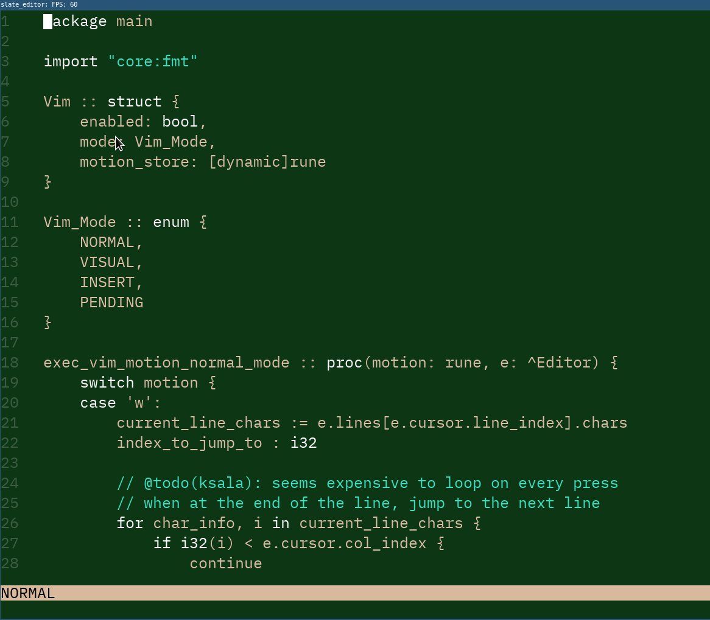

# Slate Editor
## Current state of the editor

## Roadmap
- [x] Migrate from SDL2 to SDL3
- [x] Render/draw only visible lines
- [x] Scrolling
- [x] Cursor
- [x] Delete text
- [x] Status line for vim mode (NORMAL, VISUAL, INSERT)
- [x] Add an FPS cap
- [ ] Open and read files (partially done; currently no ability to open a file while running the program)
- [ ] Use command line to edit editor appearance (font, font size, colors, etc) and to open new files
- [ ] Color code block comment (`/**/`)
- [x] Jump to line
- [ ] Search in file
- [ ] Copy/Paste
- [ ] Highlight text
- [ ] Save/Save as
- [ ] Vim motions (a, w, b, ciw, viw, dd, gg, ^, %, etc)
- [ ] Show current file name
- [ ] Mouse support (maybe? Who uses a mouse?)
- [ ] LSP support
- [ ] Indenting (probably with LSP support?)``
- [ ] Look into 'Gap buffer' & 'Rope (data strucutre)' to work with text, because storing text as char array is expensive
