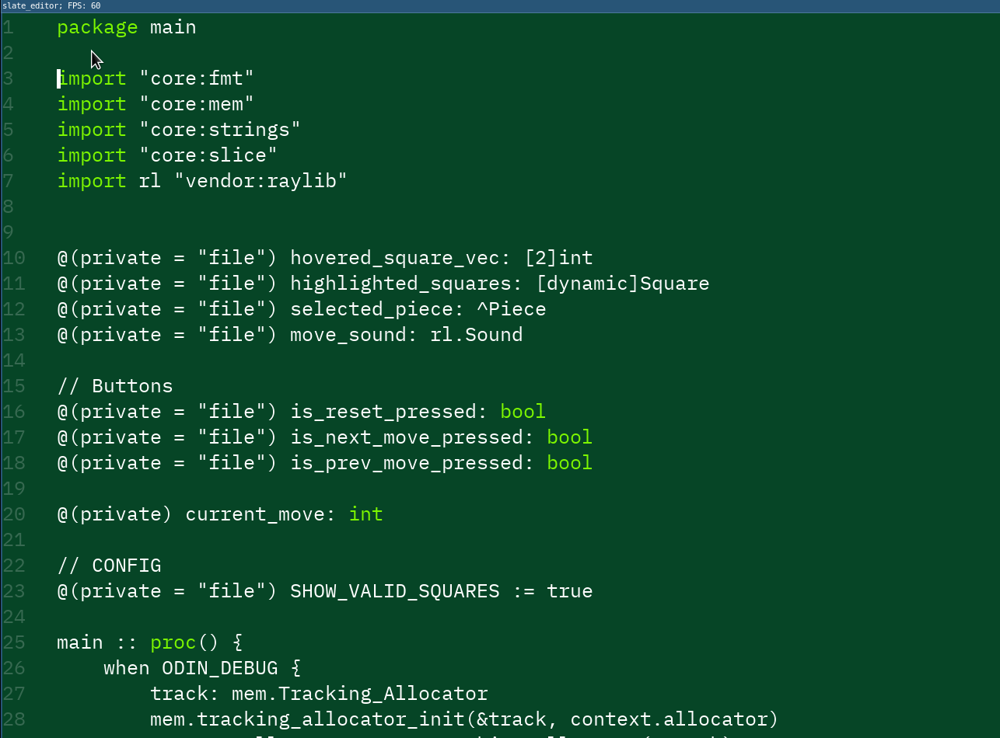

# slate_editor
## Current state of the editor

## Roadmap
- [x] Migrate from SDL2 to SDL3
- [x] Render only visible lines
- [x] Scrolling
- [x] Cursor
- [x] Delete text
- [ ] migrate over to freetype (needs bindings - do yourself)??
- [ ] with freetype add some syntax highlighting
- [x] status line for vim mode (NORMAL, VISUAL, INSERT)
- [ ] Editor settings changing support
- [ ] Command line to open files and edit editor settings
- [ ] add more vim motions (and fix the current ones)
- [ ] Open and read files (partially done; currently no ability to open a file while running the program)
- [x] Add an FPS cap
