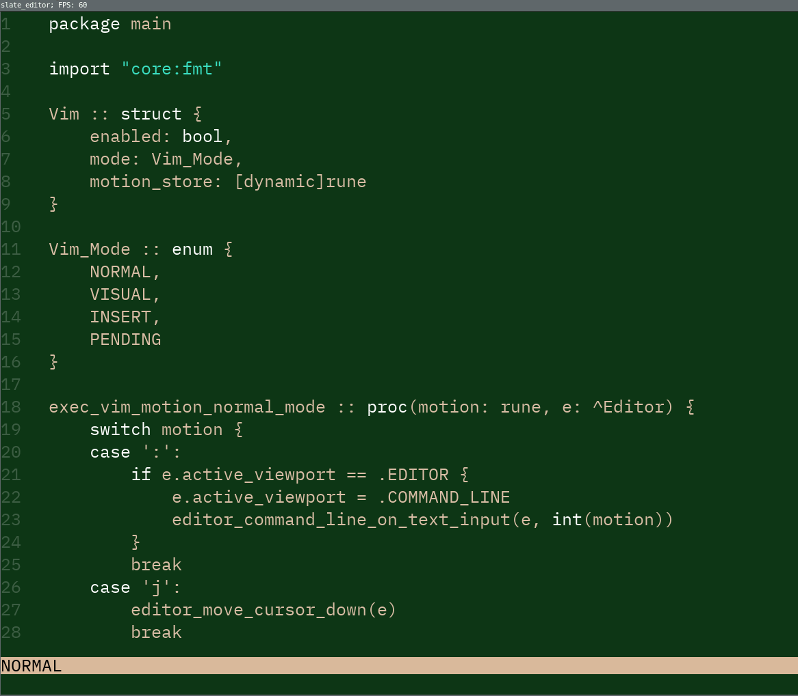

# slate_editor
## Current state of the editor

## TODO
- [x] Cache lines (mark lines dirty if they need to be rebuilt) (@note: if I'm using a glyph atlas, do I have to do this?)
- [ ] Render only visible lines
- [ ] Scrolling
- [ ] Cursor
- [ ] Delete text
- [ ] Open and read files
